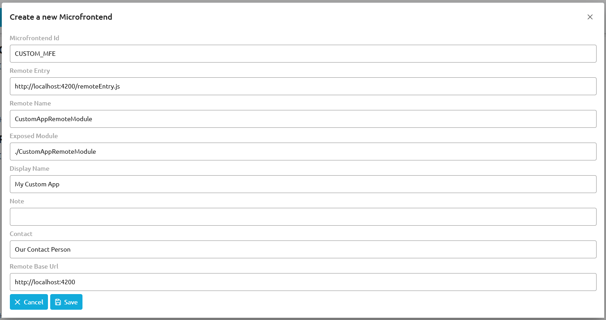
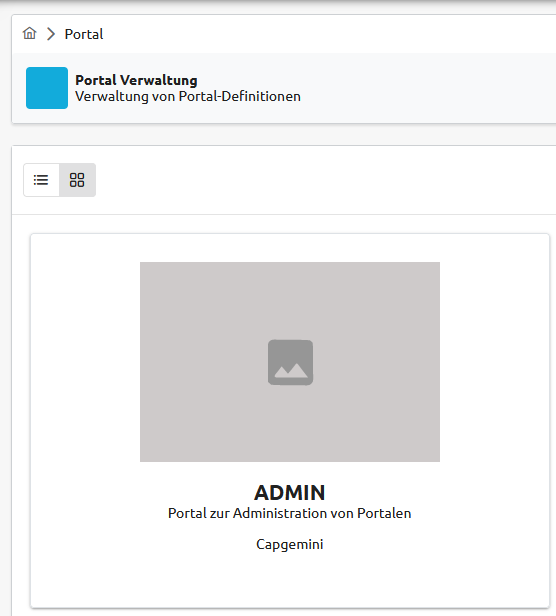
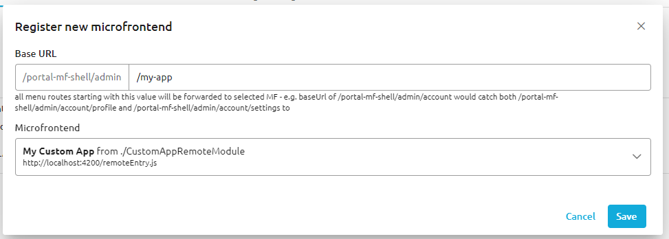

# OneCX Portal - Local dev setup

## Before

### Scripts
Make sure that .sh scripts in / directory are executable

- e.g. `-rwxr-xr-x start.sh`
- if they are not executable, use the command `chmod +x <file>`

### Hosts file

In order to expose multiple services on the same port, we use a traefik reverse proxy. It will be available via your hosts 80 port, and will route traffic to containers based on hostnames.

Therefore, for each service you want to access, add an entry to your hosts files: Windows: `c:\Windows\System32\drivers\etc\hosts` and Linux / WSL: `/etc/hosts`(wsl hosts file will be autogenerated from windows file when you restart wsl, unless you disabled that behaviour). 

A sample hosts file containing all necessary entries can be found in this repo (hosts.sample).

## Docker compose

The docker compose in this repo currently contains the following apps and services:

Core infra:

- `traefik` reverse proxy
- `postgresdb` generic postgresql db
- `keycloak-app` Access and Identity Management Tool (credentials are: admin/admin)

Core apps:

- `tkit-portal-server` Main MS for tkit portal applications, managing and storing information about Portals and Users
- `apm` MS which manages access and permissions for Portal users
- `tkit-menu-management-bff` BFF used by UI apps for sending requests to tkit-portal-server
- `portal-mf-shell` Main UI application that provides module federation shell app
- `portal-mgmt` UI application for managing portals, microfrontends, themes and menus

## Usage

To start the applications just run `./start.sh` locally. This script will spin up all necessary containers using docker-compose and will import all needed apm permissions using `setupPermissions.sh`. After the script has been executed successfully you should be able to access the portal on http://ui/portal-mf-shell/admin and log in with the default Keycloak user mentioned below.

## Initial Data

A Postgres server with all necessary databases is automatically created on startup. 

The database for Keycloak is populated with the following configuration:

- **Realm** - OneCx
- **Clients** - ping-angular-app-ui
- **User** - onecx
- **Password** - onecx
- **Roles assigned to the user** - [onecx-portal-admin, onecx-portal-user, onecx-admin, tkit-portal-admin]

Additionally, some sample data is imported into the database used by tkit-portal-server (see ./tkit-portal-server-init for details).

## App configurations

To configure your local applications to work together with the services provided by this repo, change the corresponding addresses of the services in your local app configuration, using only hostnames of the docker services.

**proxy-conf.json** example:

```json
  "/portal-api": {
    "target": "http://tkit-portal-server",
    "secure": false,
    "pathRewrite": {
      "^/portal-api": ""
    },
    "changeOrigin": true,
    "logLevel": "debug"
  },

```

**env.json** example:

```json
  "KEYCLOAK_REALM": "OneCX",
  "KEYCLOAK_URL": "http://keycloak-app/",
  "KEYCLOAK_CLIENT_ID": "ping-angular-app-ui",
  "TKIT_PORTAL_ID": "ADMIN",
```

## Add microfrontend (MFE) to portal
After setting up your own application as a compatible MFE and starting `onecx-core-docker-dev` on your local machine, you can add your app to a portal.

By completing the following steps, you should be able to access your app as a microfrontend in the admin portal (at http://ui/portal-mf-shell/my-app/).

### 1. Start app and verify that it works as expected
Once you're done setting up your application, you need to verify that it exposes a JavaScript file that can be used as an entrypoint for serving your app as a microfrontend. In the case of OneCX Angular apps running on Angulars default port, this file will usually be located at http://localhost:4200/remoteEntry.js. If you're able to access this entrypoint file using some localhost URL, you should be good to go.

### 2. Create a microfrontend configuration for your application
Before you can add your app to an actual portal, you need to create a related microfrontend configuration using the portal UI.

Start by navigating to http://ui/portal-mf-shell/admin/config and click on "Create Microfrontend".

Afterward, you should be able to fill in all details of your MFE compatible application:



**Microfrontend Id** has to be a unique id. At the time of writing this guide, you still have to manually define this id in the dialog. In the near future, the id field will be removed and the id itself will be auto-generated.

**Remote Entry** points the portal to the location of your entrypoint JavaScript file. The value of this field should be some localhost or public URL that can be used to retrieve said file.

**Remote Name** should contain the class name used in the remote module that you defined for your app.

**Exposed Module** should also contain the class name used in your remote module. However it needs to be prefixed with ./ so that it points the portal to the correct module.

**Display Name** can be whatever you want it to be. Just give your microfrontend a name that you will recognize when you actually want to register the MFE later.

**Note (Optional)** is an optional value and can be whatever text you want it to be.

**Contact** should be used for defining the name of the person responsible for your MFE. In local dev feel free to use some imaginary value here.

**Remote Base Url** points the portal to the actual URL of your application. If you're running a normal Angular app on port 4200 this might be something like http://localhost:4200.

Once you entered all necessary information, click "Save".

### 3. Register your application as an MFE in a portal
Navigate to http://ui/portal-mf-shell/admin and click on the existing "Admin" portal (should be auto-imported when starting `onecx-core-docker-dev`).



Afterward, navigate to the "Microfrontends" tab, scroll all the way down and click on "Add MF".



In the shown dialog you should be able to choose the previously defined MFE configuration from the displayed dropdown and you should be prompted to define the base url for your app. In our example scenario we used /my-app. After defining all necessary information you need to once again click "Save".

### 4. Try to access your application
Congrats! If you correctly followed all steps you should now be able to access your own MFE app at http://ui/portal-mf-shell/admin/my-app.
